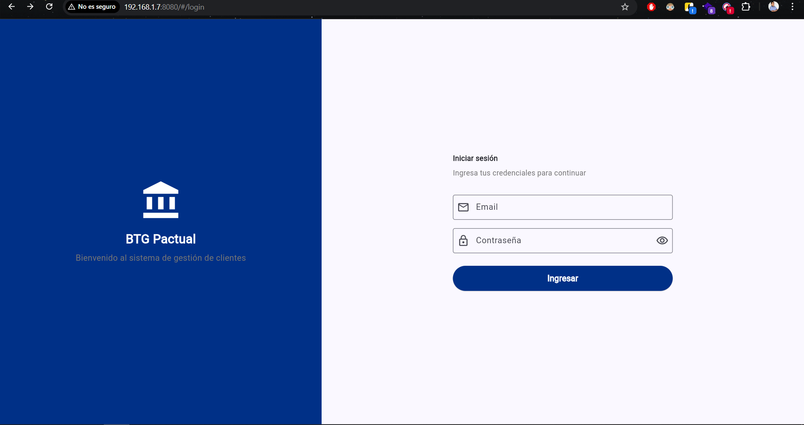
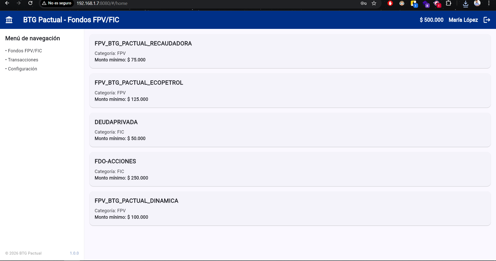
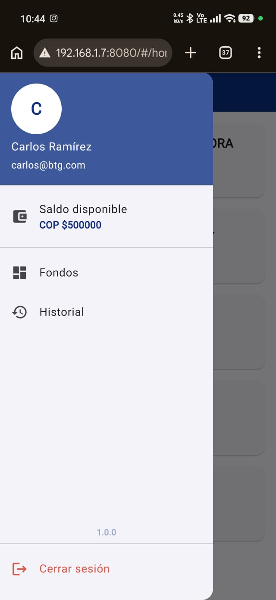

# fpv_fic

A new Flutter project.

## Getting Started

This project is a starting point for a Flutter application.

## 🚀 Cómo correr el proyecto

### 1. Instala las dependencias

```bash
flutter pub get
```

### 2. Corre la aplicación

```bash
flutter run -d web-server --web-hostname=0.0.0.0 --web-port=8080
```

### 3. Accede a la aplicación en tu navegador
Abre tu navegador y ve a `http://localhost:8080` para ver la aplicación en acción.

### 3.1 Desde tu celular u otro dispositivo
Si quieres acceder a la aplicación desde otro dispositivo en la misma red, asegúrate de usar la dirección IP de tu computadora en lugar de `localhost`. Por ejemplo, si tu dirección IP es `

Paso 1 – Encuentra tu IP local
En Windows, abre la terminal y ejecuta:

```bash
ipconfig
```
Busca la sección de tu adaptador de red (por ejemplo, "Adaptador de Ethernet" o "Adaptador de Wi-Fi") y encuentra la dirección IPv4 (algo como `192.168.x.x`).
Paso 2 – Usa tu IP local
En lugar de `localhost`, usa tu dirección IP local seguida del puerto. Por ejemplo:

```bash
http://192.168.x.x:8080
```
Esto te permitirá acceder a la aplicación desde cualquier dispositivo conectado a la misma red local.

## 📸 Capturas de pantalla

### Login



### Home - Vista Web


### Vista Mobile
.jpeg)


